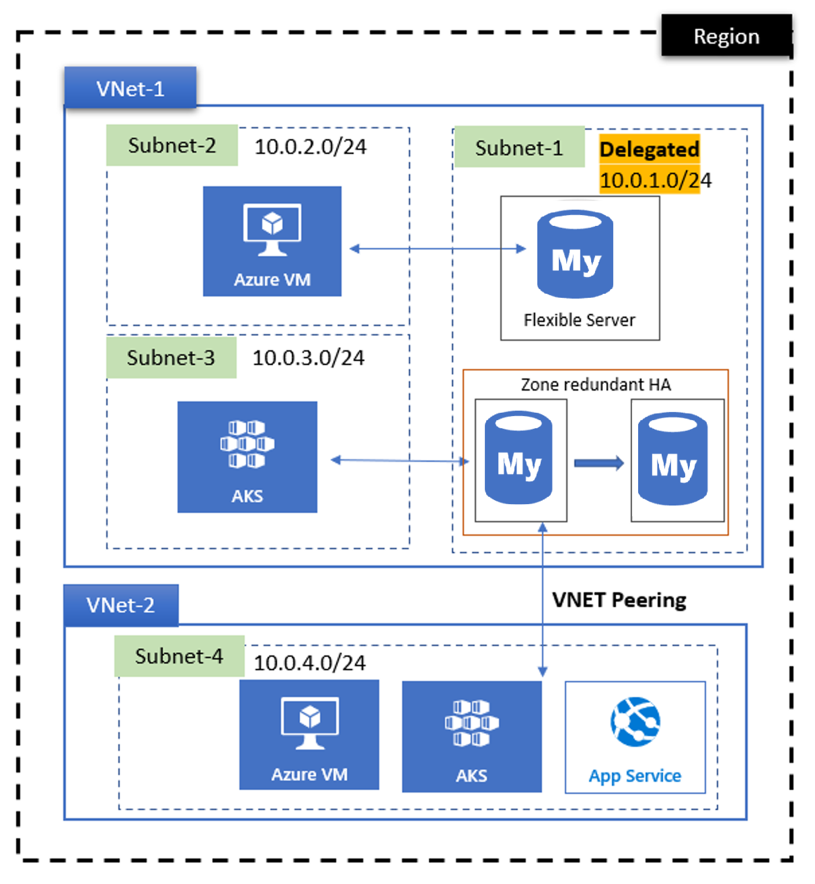

#### Creates a resource group for all resources under a specified name and location

```hcl
resource "azurerm_resource_group" "DevOps" {
  name     = var.name         # Name of the resource group, provided as a variable
  location = var.location     # Location of the resource group, e.g., "East US"
}
```
- Sets up a Network Security Group (NSG) within the resource group to control subnet traffic

```hcl
resource "azurerm_network_security_group" "DevOps" {
  name                = "devops-security-group"              # Unique name for the NSG
  location            = azurerm_resource_group.DevOps.location # Uses location of the resource group
  resource_group_name = azurerm_resource_group.DevOps.name     # Assigns NSG to the created resource group
}

# Creates a Virtual Network with defined subnets within the specified resource group
resource "azurerm_virtual_network" "DevOps" {
  name                = "devops-network"                     # Name for the virtual network
  location            = azurerm_resource_group.DevOps.location # Same location as the resource group
  resource_group_name = azurerm_resource_group.DevOps.name     # Assigns to the existing resource group
  address_space       = var.address_space                      # CIDR address space for the VNet, provided as a variable

  # Public subnet configuration
  subnet {
    name             = "public"                               # Name of the subnet for public resources
    address_prefixes = var.subnet_address_prefixes["public"]  # Address prefix for the public subnet from variable map
  }

  # Private subnet configuration, protected by a Network Security Group (NSG)
  subnet {
    name             = "private"                              # Name of the subnet for private resources
    address_prefixes = var.subnet_address_prefixes["private"] # Address prefix for the private subnet from variable map
    security_group   = azurerm_network_security_group.DevOps.id # Associates NSG to manage traffic rules
  }

  tags = {
    environment = "production"                                # Tags for easier resource identification
  }
}
```
